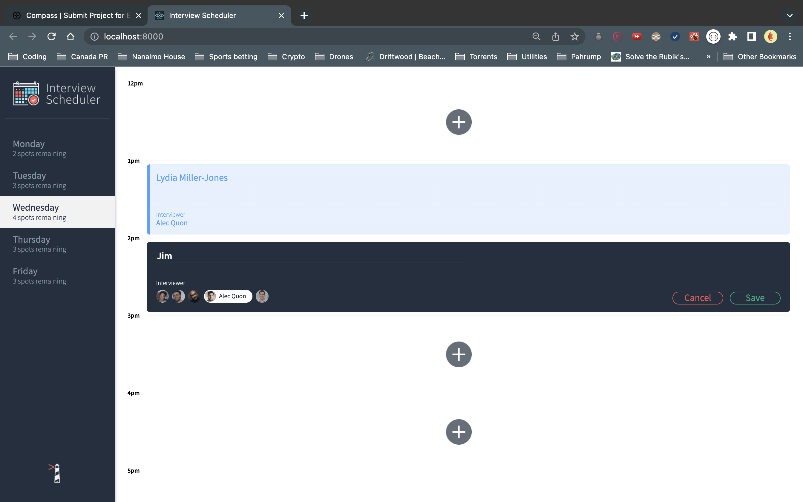
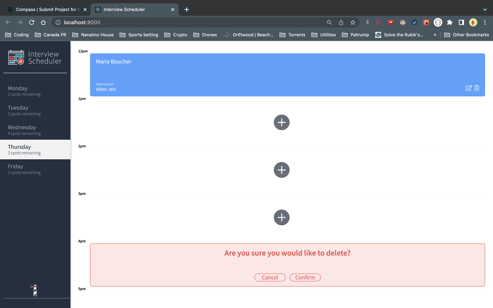

# Interview Scheduler
This Interview Scheduler was created using React.  It works as a scheduling tool for students to connect with mentors.  It connects on the back end to an API and a WebSocket server, and is capable of storing data and dynamically showing appointment data.

# Final Product






## Setup

Install dependencies with `npm install`.

- axios
- @testing-library/react-hooks
- react-test-renderer

## Running Webpack Development Server

```sh
npm start
```

## Running Jest Test Framework

```sh
npm test
```

## Running Storybook Visual Testbed

```sh
npm run storybook
```


